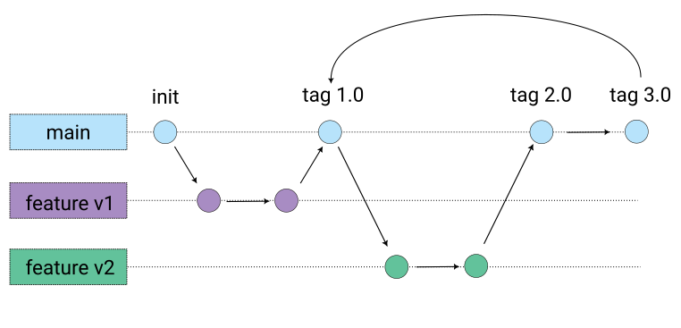
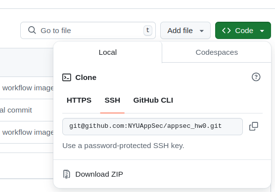
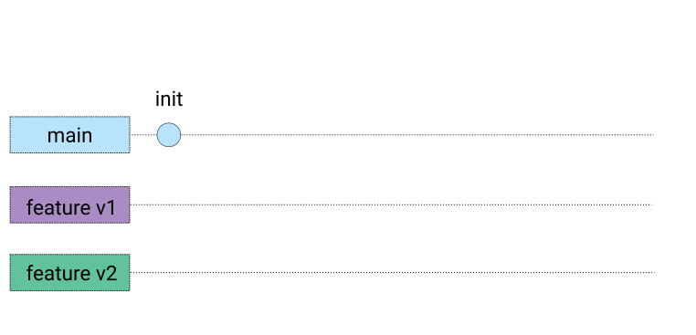
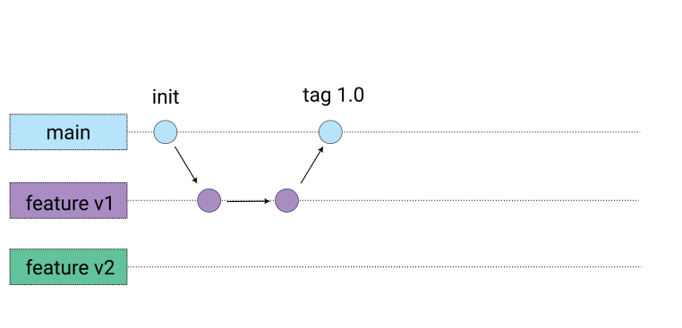
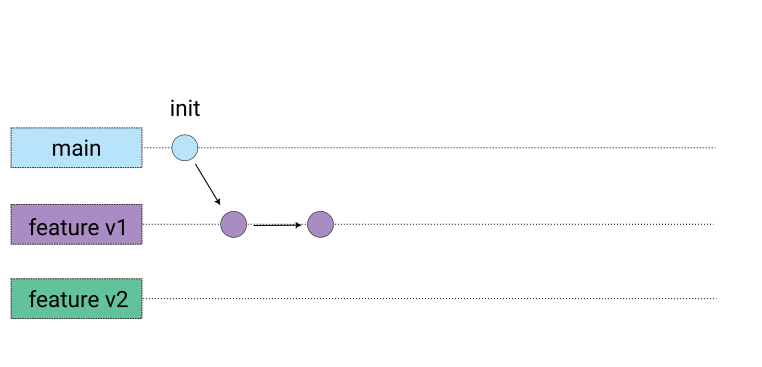
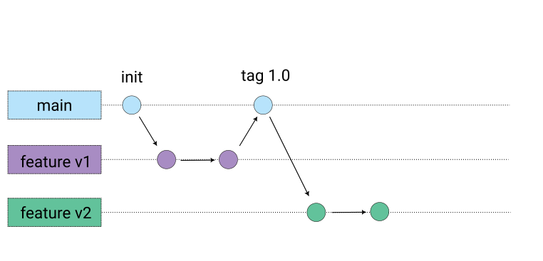
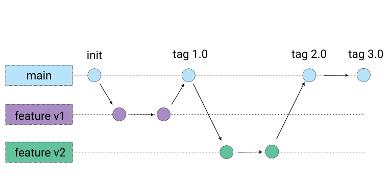

# Homework 0: Getting Good with Git
A starter assignment to ensure things are set up and working properly with Github.

## Overview
With this lab, we'll make sure you're set up with git and GitHub so that you can:
- push to and pull from GitHub without entering a password
- clone a repository
- automatically sign your commits
- navigate github branches with ease
- roll back to previous commits as needed
All of these things are essential for the work we'll be doing in this class. The good news is, even if you're not familiar with any of this just yet, it's not that tricky after you practice a few times.

In this lab, we'll work through the flow below that takes a project from initialization through version 3.0 and then back to version 1.0. This lab should spell out how to do everything step by step.



## Setup
Before we get started with the assignment, we just need to get some housekeeping out of the way. If you already have your SSH and GPG keys set up and integrated with git and GitHub, you can skip this section. For those that don't, please invest the time getting this set up now. It will pay dividends down the road.

### SSH Key Setup Guide

#### Generate an SSH key
For a detailed guide, please see [Connecting to GitHub with SSH](https://docs.github.com/en/authentication/connecting-to-github-with-ssh). If you already have a public key, you can use that, but if you don't go ahead and create a new one with the following command. Just be sure that instead of netid@nyu.edu, you use your actual email address.
```bash
ssh-keygen -t ed25519 -C "netid@nyu.edu"
```
You can save it in the default location which is usually ~.ssh/id_ed25519

When creating your SSH key, we recommend using a passphrase for added security. Don't worry about having to enter it frequently - we'll set up your system to remember it. This way, you'll learn best practices for security while maintaining convenience.

- What it does: Generates a new SSH key pair (public and private keys).
- `-t ed25519`: Specifies the type of key to create. ED25519 is a modern, secure, and efficient algorithm.
- `-C "netid@nyu.edu"`: Adds a comment to the key. The email is used as an identifier and can help manage multiple keys.

Platform notes:
- Works on Windows (via Git Bash or WSL as we have or will discuss in class), Mac, and Linux.
- Windows users may need to install Git for Windows, which includes Git Bash.

#### Add the SSH key to your SSH agent

```bash
eval "$(ssh-agent -s)"
ssh-add ~/.ssh/id_ed25519
```

- What it does: Starts the ssh-agent and adds your SSH key to it.
- `ssh-agent`: A program that holds private keys for authentication. It saves you from typing your passphrase every time you connect to a server.
- `eval "$(ssh-agent -s)"`: Starts the ssh-agent and sets necessary environment variables.
- `ssh-add`: Adds your private key to the agent.

Platform notes:
- On Mac, you might need to add these lines to your `~/.ssh/config` file:
  ```
  Host *
    AddKeysToAgent yes
    UseKeychain yes
    IdentityFile ~/.ssh/id_ed25519
  ```
- On Windows, you might need to start ssh-agent manually or set it to start automatically with your session.

#### Copy your SSH public key

```bash
cat ~/.ssh/id_ed25519.pub
```

- What it does: Displays the content of your public key file, which you'll copy to GitHub.

Platform notes:
- On Windows, you might use `type` instead of `cat` if not using Git Bash.
- On Mac/Linux, you can use `pbcopy < ~/.ssh/id_ed25519.pub` to copy directly to clipboard.

#### Add the SSH key to your GitHub account

- Go to GitHub Settings > SSH and GPG keys > New SSH key
- Select a name for your key (it doesn't matter what this is, it's just for you to identify it later)
- Paste your public key and save

What it does: This step associates your local machine with your GitHub account, allowing secure, password-less interactions.

Additional Notes:
- Ensure you're copying the `.pub` file (public key), not the private key.
- The private key should never be shared and should remain secure on your local machine.

Installation Requirements:
- Mac/Linux: Usually comes with SSH pre-installed.
- Windows: Install Git for Windows (includes Git Bash) or use WSL (Windows Subsystem for Linux).
- All platforms: Ensure Git is installed (`git --version` to check).

By setting up SSH keys, you're establishing a secure, encrypted connection between your local machine and GitHub, enhancing security and convenience when interacting with repositories.

### GPG Key Setup Guide for Git and GitHub

#### What is GPG and why use it?

GPG (GNU Privacy Guard) is a tool for secure communication and data encryption. In the context of Git and GitHub, GPG is used to sign commits, proving that they genuinely came from you. This adds an extra layer of security and verification to your work.

#### Generate a GPG key

```bash
gpg --full-generate-key
```

- What it does: Initiates the process to generate a new GPG key pair.
- Follow the prompts:
  - Choose RSA and RSA (default)
  - Set the key size to 4096 bits for strong security
  - Set the key to never expire (or choose an expiration time)
  - Enter your name and email address (use the same email as your GitHub account)
  - Set a secure passphrase

Platform notes:
- Works on Windows (via Git Bash or WSL), Mac, and Linux.
- Windows users may need to install GPG separately (Gpg4win recommended).
- Mac users can install GPG via Homebrew: `brew install gnupg`

#### List your GPG keys

```bash
gpg --list-secret-keys --keyid-format LONG
```

- What it does: Displays your GPG keys, helping you identify the key ID you'll need for Git configuration.

#### Export your GPG public key

```bash
gpg --armor --export YOUR_KEY_ID
```

- Replace `YOUR_KEY_ID` with the ID of the key you just generated (it looks like a long alphanumeric string).
- What it does: Exports your public key in ASCII-armored format, which you'll copy to GitHub.

#### Add the GPG key to your GitHub account

- Go to GitHub Settings > SSH and GPG keys > New GPG key
- Paste your GPG public key and save

What it does: This step allows GitHub to verify commits signed with your GPG key.

#### Configure Git to use your GPG key

```bash
git config --global user.signingkey YOUR_KEY_ID
git config --global commit.gpgsign true
```

- What it does: 
  - Sets your GPG key for Git to use when signing commits.
  - Configures Git to sign all commits by default.

#### Troubleshooting

If you encounter issues with GPG, especially on Mac, you might need to add this to your shell configuration file (e.g., `~/.bash_profile`, `~/.zshrc`):

```bash
export GPG_TTY=$(tty)
```

This ensures GPG can prompt for the passphrase when needed.

#### Additional Notes

- Keep your private key and passphrase secure and never share them.
- If you're using multiple machines, you'll need to set up GPG on each one.
- Some IDEs and Git clients have built-in support for GPG signing. Check your tool's documentation for integration details.

By setting up GPG signing, you're adding an extra layer of verification to your commits, ensuring that your work is authenticated and tamper-evident.

## Repository Cloning 
Now that our setup is out of the way, cloning the repository will be a snap.Near the top of this repository, click the "<> Code" button and copy the SSH clone path. NOTE: This will be different for you than the image since you accepted this assignment via classrooms.



```bash
git clone git@github.com:NYUAppSec/appsec_hw0.git # NOTE: Change this as instructed
```



If we were starting a new repository without cloning it from GitHub, we could have done the following:
```bash
mkdir appsec_hw0
cd appsec_hw0
git init
```

## Looking Arround
Now that your repository is cloned, let's take a look around. Start by entering your repository.
```bash
cd appsec_hw0/
ls # shows README.md
```
Not a lot to see here just yet, but we'll fix that. Let's see what branch we're on.
```bash
git branch # shows * main
```

So we're on the main branch. Before we start changing things, let's create a branch to work from so that we can always come back to this clean state if we need to.

## Create and Develop feature/v1

```bash
git checkout -b feature/v1
echo "version 0.2" > version.txt
git add version.txt # could also be: git add .
git commit -m "update version to 0.2"
echo "version 0.3" > version.txt
git commit -am "update version to 0.3"
```



## Merge feature/v1 and Create Tag 1.0

```bash
git checkout main
git merge feature/v1
echo "version 1.0" > version.txt
git commit -am "update version to 1.0"
git tag -a v1.0 -m "Release version 1.0"
```



## Create and Develop feature/v2

```bash
git checkout -b feature/v2
echo "version 1.1" > version.txt
git commit -am "update version to 1.1"
echo "version 1.2" > version.txt
git commit -am "update version to 1.2"
```



## Merge feature/v2 and Create Tag 2.0

```bash
git checkout main
git merge feature/v2
echo "version 2.0" > version.txt
git commit -am "update version to 2.0"
git tag -a v2.0 -m "Release version 2.0"
```


## Continue Development on main and Create Tag 3.0

```bash
echo "version 3.0" > version.txt
git commit -am "update version to 3.0"
git tag -a v3.0 -m "Release version 3.0"
```



## Demonstrate Rolling Back to v1.0

To view the state of the project at v1.0:
```bash
git checkout v1.0
cat version.txt  # This will show "version 1.0"
```


To return to the latest state:
```bash
git checkout main
cat version.txt  # This will show "version 3.0"
```

## Additional Notes

- The `checkout` command is used to switch between branches and tags.
- The `-b` flag with `checkout` creates a new branch.
- The `-a` flag with `tag` creates an annotated tag, which includes additional metadata.
- Always ensure you're on the correct branch before making changes or merging.
- Use `git status` frequently to check your current branch and state.
- Use `git log --oneline --decorate --graph --all` to visualize your branch structure.

This branching model demonstrates a typical feature branch development process, where features are developed in isolation and then merged into the main branch for releases. The version.txt file helps to clearly illustrate the version progression throughout the development process.


